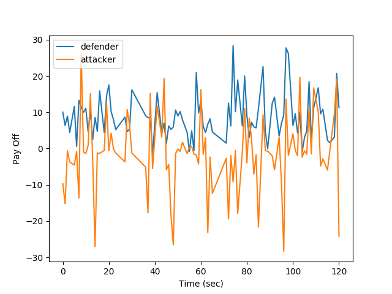
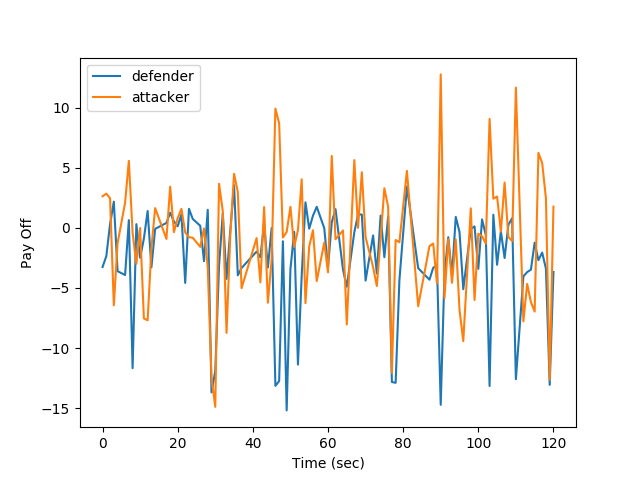
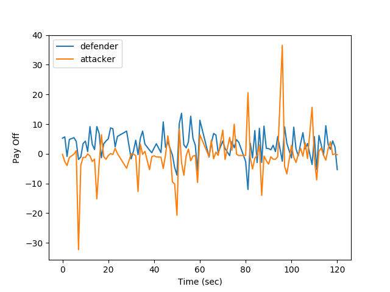
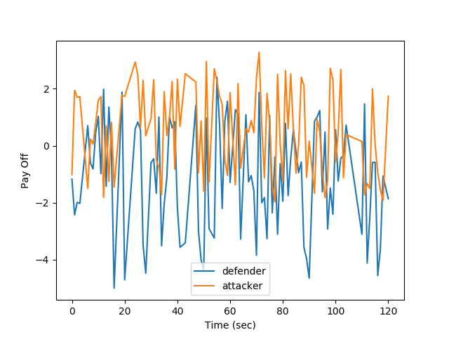
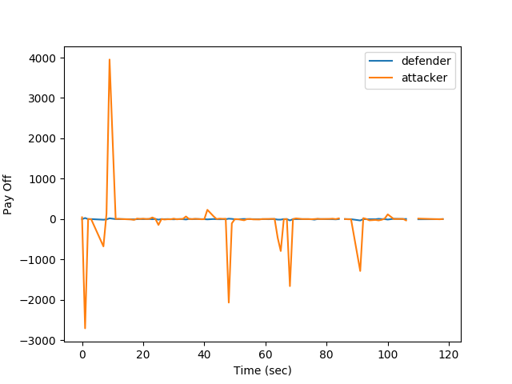
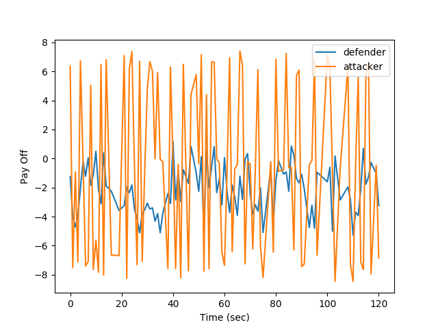

# Simulation of GTM-CSec

Game theory model for cloud security based on IDS and honeypot.

## Modules:
* drawnow
* matplotlib
* pandas
* numpy
* random
* schedule

## How to start?
* Install dependecies:
    - `pip install -r requirements.txt`
* Run script:
    - `python generate.py`

Note: chek result in `output.png` folder.

Research Paper Link: https://www.sciencedirect.com/science/article/pii/S0167404820300195

## Samples:

1) Case 2: 

2) Case 3: 

3) Case 4: 

4) Case 5: 

5) Case 6: 

6) Case 7: 

